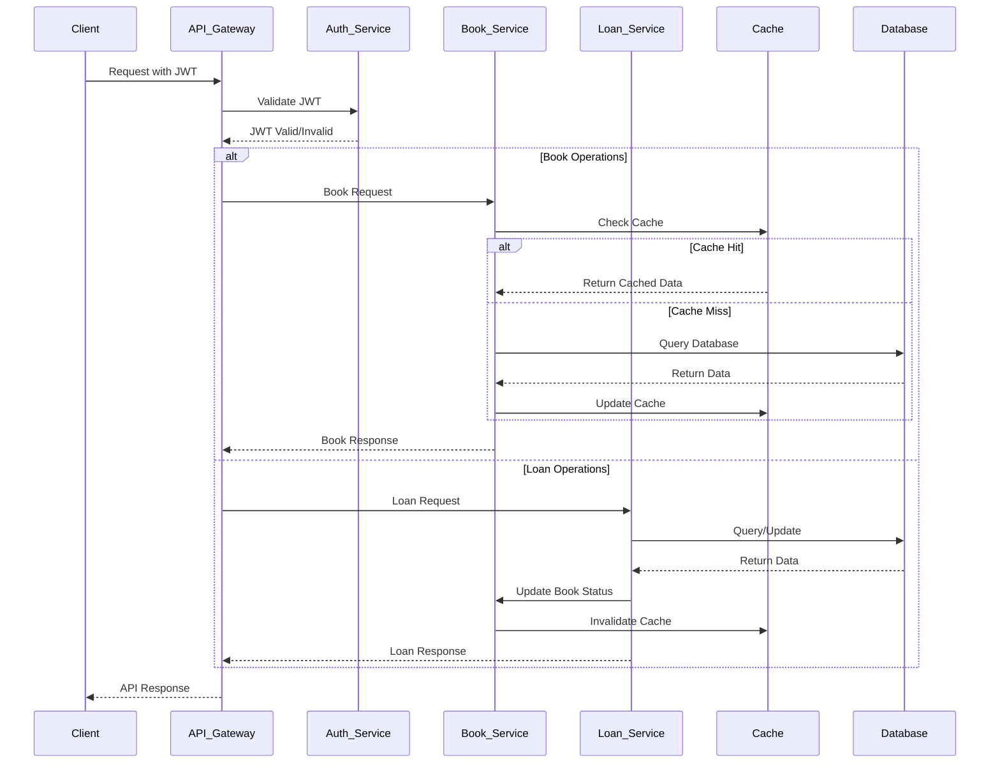

# Library Management System API

## Overview

This project is a Spring Boot application that provides RESTful APIs for managing a library system. It includes authentication using JWT tokens, role-based access control, comprehensive error handling with custom exceptions, and caching for improved performance.

## Prerequisites

- Java 17
- Maven
- MySQL Database
- Docker (for containerization)
- Kubernetes (for orchestration)

## Getting Started

### 1. Clone the Repository

```bash
git clone https://github.com/your-repo/library-management-be.git
cd library-management-be
```

### 2. Configure the Application
   Create an application.properties file in the src/main/resources directory with the following content:
   ```properties
spring.datasource.url=jdbc:mysql://localhost:3306/"your db"
spring.datasource.username=root
spring.datasource.password=
spring.jpa.hibernate.ddl-auto=update
spring.datasource.driver-class-name=com.mysql.cj.jdbc.Driver
spring.batch.initialize-schema=always
schema=always
```

### 3. Build and Run the Application
Use Maven to build and run the application:

```bash
mvn clean install
mvn spring-boot:run
```

## Docker Setup

### 1. Install Docker
First, make sure you have Docker installed on your system:
- For Windows/Mac: Download and install Docker Desktop from [https://www.docker.com/products/docker-desktop](https://www.docker.com/products/docker-desktop)
- For Linux: Follow the instructions at [https://docs.docker.com/engine/install/](https://docs.docker.com/engine/install/)

Verify the installation:
```bash
docker --version
```

### 2. Create a Dockerfile
The project already includes a Dockerfile with the following content:

```dockerfile
FROM openjdk:17-jdk-slim

WORKDIR /app

COPY target/library-management-*.jar app.jar

EXPOSE 8080

ENTRYPOINT ["java", "-jar", "app.jar"]
```

### 3. Build and Run the Docker Image

Build your application first:
```bash
mvn clean package -DskipTests
```

Build the Docker image:
```bash
docker build -t library-management-api:latest .
```

Run the container:
```bash
docker run -p 8080:8080 \
  -e SPRING_DATASOURCE_URL=jdbc:mysql://host.docker.internal:3306/librarydb \
  -e SPRING_DATASOURCE_USERNAME=root \
  -e SPRING_DATASOURCE_PASSWORD=password \
  library-management-api:latest
```

For external database connections, create a Docker network:
```bash
# Create a network
docker network create library-network

# Run MySQL container
docker run --name mysql-db --network library-network -e MYSQL_ROOT_PASSWORD=password -e MYSQL_DATABASE=librarydb -p 3306:3306 -d mysql:8.0

# Run the application container
docker run --name library-api --network library-network -p 8080:8080 \
  -e SPRING_DATASOURCE_URL=jdbc:mysql://mysql-db:3306/librarydb \
  -e SPRING_DATASOURCE_USERNAME=root \
  -e SPRING_DATASOURCE_PASSWORD=password \
  library-management-api:latest
```

### 4. Using Docker Compose
Create a docker-compose.yml file for easier orchestration of multiple containers:

```yaml
version: '3.8'

services:
  mysql:
    image: mysql:8.0
    container_name: mysql-db
    environment:
      MYSQL_ROOT_PASSWORD: password
      MYSQL_DATABASE: librarydb
    ports:
      - "3306:3306"
    volumes:
      - mysql-data:/var/lib/mysql
    networks:
      - library-network

  library-api:
    build: .
    container_name: library-api
    depends_on:
      - mysql
    ports:
      - "8080:8080"
    environment:
      SPRING_DATASOURCE_URL: jdbc:mysql://mysql:3306/librarydb
      SPRING_DATASOURCE_USERNAME: root
      SPRING_DATASOURCE_PASSWORD: password
    networks:
      - library-network

networks:
  library-network:
    driver: bridge

volumes:
  mysql-data:
```

Run with Docker Compose:
```bash
docker-compose up -d
```

Stop and remove containers:
```bash
docker-compose down
```

## Kubernetes Setup

### 1. Install Kubernetes Tools
First, ensure you have the necessary tools:

- **kubectl**: The Kubernetes command-line tool
  - Windows: `choco install kubernetes-cli` (with Chocolatey)
  - macOS: `brew install kubectl` (with Homebrew)
  - Linux: [Follow the docs](https://kubernetes.io/docs/tasks/tools/install-kubectl-linux/)

- **minikube**: For local Kubernetes development
  - Windows: `choco install minikube`
  - macOS: `brew install minikube`
  - Linux: [Follow the docs](https://minikube.sigs.k8s.io/docs/start/)

### 2. Start a Local Kubernetes Cluster
Initialize a local Kubernetes cluster with minikube:

```bash
minikube start --driver=docker
```

Verify the cluster is running:
```bash
kubectl cluster-info
```

### 3. Create Kubernetes Configuration Files

#### Create a Secret for Sensitive Data
Create the `library-secrets.yml` file:

```yaml
apiVersion: v1
kind: Secret
metadata:
  name: library-secrets
type: Opaque
data:
  db-username: cm9vdA== # base64 encoded "root"
  db-password: cGFzc3dvcmQ= # base64 encoded "password"
  jwt-secret: Y2hhbmdlLW1lLWluLXByb2R1Y3Rpb24= # base64 encoded "change-me-in-production"
```

You can encode your own values using:
```bash
echo -n 'your-value' | base64
```

#### Create ConfigMap for Application Configuration
Create the `library-config.yml` file:

```yaml
apiVersion: v1
kind: ConfigMap
metadata:
  name: library-config
data:
  application.properties: |
    spring.datasource.url=jdbc:mysql://mysql-service:3306/librarydb
    spring.jpa.hibernate.ddl-auto=update
    spring.datasource.driver-class-name=com.mysql.cj.jdbc.Driver
    spring.batch.initialize-schema=always
    logging.level.org.springframework=INFO
    logging.level.com.mb.transactionbackend=DEBUG
```

#### Create MySQL Deployment and Service
Create the `mysql-deployment.yml` file:

```yaml
apiVersion: apps/v1
kind: Deployment
metadata:
  name: mysql
spec:
  replicas: 1
  selector:
    matchLabels:
      app: mysql
  template:
    metadata:
      labels:
        app: mysql
    spec:
      containers:
      - name: mysql
        image: mysql:8.0
        ports:
        - containerPort: 3306
        env:
        - name: MYSQL_ROOT_PASSWORD
          valueFrom:
            secretKeyRef:
              name: library-secrets
              key: db-password
        - name: MYSQL_DATABASE
          value: librarydb
        volumeMounts:
        - name: mysql-data
          mountPath: /var/lib/mysql
      volumes:
      - name: mysql-data
        persistentVolumeClaim:
          claimName: mysql-pvc
---
apiVersion: v1
kind: Service
metadata:
  name: mysql-service
spec:
  selector:
    app: mysql
  ports:
  - port: 3306
    targetPort: 3306
  type: ClusterIP
---
apiVersion: v1
kind: PersistentVolumeClaim
metadata:
  name: mysql-pvc
spec:
  accessModes:
    - ReadWriteOnce
  resources:
    requests:
      storage: 1Gi
```

#### Create API Deployment and Service
Create the `library-deployment.yml` file:

```yaml
apiVersion: apps/v1
kind: Deployment
metadata:
  name: library-api
spec:
  replicas: 2
  selector:
    matchLabels:
      app: library-api
  template:
    metadata:
      labels:
        app: library-api
    spec:
      containers:
      - name: library-api
        image: library-management-api:latest
        imagePullPolicy: IfNotPresent
        ports:
        - containerPort: 8080
        env:
        - name: SPRING_DATASOURCE_USERNAME
          valueFrom:
            secretKeyRef:
              name: library-secrets
              key: db-username
        - name: SPRING_DATASOURCE_PASSWORD
          valueFrom:
            secretKeyRef:
              name: library-secrets
              key: db-password
        volumeMounts:
        - name: config-volume
          mountPath: /app/config
        livenessProbe:
          httpGet:
            path: /actuator/health
            port: 8080
          initialDelaySeconds: 60
          periodSeconds: 30
        readinessProbe:
          httpGet:
            path: /actuator/health
            port: 8080
          initialDelaySeconds: 30
          periodSeconds: 10
      volumes:
      - name: config-volume
        configMap:
          name: library-config
---
apiVersion: v1
kind: Service
metadata:
  name: library-api-service
spec:
  selector:
    app: library-api
  ports:
  - port: 80
    targetPort: 8080
  type: LoadBalancer
```

#### Create Ingress for External Access
For external access, create an ingress controller (if using minikube, enable the addon first):

```bash
minikube addons enable ingress
```

Create the `library-ingress.yml` file:

```yaml
apiVersion: networking.k8s.io/v1
kind: Ingress
metadata:
  name: library-ingress
  annotations:
    nginx.ingress.kubernetes.io/rewrite-target: /
spec:
  rules:
  - host: library.local
    http:
      paths:
      - path: /
        pathType: Prefix
        backend:
          service:
            name: library-api-service
            port:
              number: 80
```

### 4. Deploy to Kubernetes

Apply all the configurations:

```bash
# Create secrets first
kubectl apply -f library-secrets.yml

# Create configmap
kubectl apply -f library-config.yml

# Deploy MySQL
kubectl apply -f mysql-deployment.yml

# Wait for MySQL to be ready
kubectl wait --for=condition=ready pod -l app=mysql --timeout=120s

# Deploy API
kubectl apply -f library-deployment.yml

# Create ingress
kubectl apply -f library-ingress.yml
```

### 5. Verify the Deployment

Check pod status:
```bash
kubectl get pods
```

Check services:
```bash
kubectl get services
```

Check ingress:
```bash
kubectl get ingress
```

Access the API (if using minikube):
```bash
# Get the minikube IP
minikube ip

# Add entry to hosts file
echo "$(minikube ip) library.local" | sudo tee -a /etc/hosts

# Now you can access the API at http://library.local
```

Or use port forwarding for direct access:
```bash
kubectl port-forward service/library-api-service 8080:80
```

### 6. Scaling the Application

Scale the deployment manually:
```bash
kubectl scale deployment library-api --replicas=3
```

Or set up Horizontal Pod Autoscaler (HPA):
```yaml
apiVersion: autoscaling/v2
kind: HorizontalPodAutoscaler
metadata:
  name: library-api-hpa
spec:
  scaleTargetRef:
    apiVersion: apps/v1
    kind: Deployment
    name: library-api
  minReplicas: 2
  maxReplicas: 5
  metrics:
  - type: Resource
    resource:
      name: cpu
      target:
        type: Utilization
        averageUtilization: 70
```

Apply the HPA:
```bash
kubectl apply -f library-hpa.yml
```

## Available APIs

### Authentication
1. Register a New User
   - Endpoint: `/api/auth/register`
   - Method: POST 
- Request Body:
```json
{
    "username": "newuser",
    "password": "Pass@123Word456"
}
```
- Response:
```json
{
    "success": true,
    "message": "User registered successfully",
    "data": {
        "id": 1,
        "username": "newuser"
    }
}
```

2. Login and Get JWT Token
    - Endpoint: `/api/auth/login`
    - Method: POST
- Request Body:
```json
{
  "username": "newuser",
  "password": "Pass@123Word456"
}
```
- Response:
```json
{
  "success": true,
  "message": "Login successful",
  "data": {
    "token": "your_jwt_token"
  }
}
```

### Book Management

1. Register a New Book
   - Endpoint: `/api/books`
   - Method: POST
   - Headers:
     - Authorization: Bearer your_jwt_token
- Request Body:
```json
{
  "isbn": "9780141439518",
  "title": "Pride and Prejudice",
  "author": "Jane Austen"
}
```
- Response:
```json
{
  "success": true,
  "message": "Book registered successfully",
  "data": {
    "bookId": "b001",
    "isbn": "9780141439518",
    "title": "Pride and Prejudice",
    "author": "Jane Austen"
  }
}
```

2. List All Books
   - Endpoint: `/api/books`
   - Method: GET
   - Headers:
     - Authorization: Bearer your_jwt_token
- Response:
```json
{
  "success": true,
  "message": "Books retrieved successfully",
  "data": [
    {
      "bookId": "b001",
      "isbn": "9780141439518",
      "title": "Pride and Prejudice",
      "author": "Jane Austen",
      "loaned": false
    }
  ]
}
```

3. Get a Book by ID
   - Endpoint: `/api/books/{bookId}`
   - Method: GET
   - Headers:
     - Authorization: Bearer your_jwt_token
- Response:
```json
{
  "success": true,
  "message": "Book retrieved successfully",
  "data": {
    "bookId": "b001",
    "isbn": "9780141439518",
    "title": "Pride and Prejudice",
    "author": "Jane Austen",
    "loaned": false
  }
}
```

### Loan Management

1. Create a New Loan
   - Endpoint: `/api/loans`
   - Method: POST
   - Headers:
     - Authorization: Bearer your_jwt_token
- Request Body:
```json
{
  "borrowerId": "borrower123",
  "bookId": "b001"
}
```
- Response:
```json
{
  "success": true,
  "message": "Loan created successfully",
  "data": {
    "loanId": "l001",
    "borrower": {
      "borrowerId": "borrower123",
      "name": "John Doe"
    },
    "book": {
      "bookId": "b001",
      "title": "Pride and Prejudice"
    },
    "borrowedAt": "2023-08-01T10:00:00",
    "returnedAt": null,
    "dueDate": "2023-08-15T10:00:00"
  }
}
```

2. Return a Book
   - Endpoint: `/api/loans/{loanId}/return`
   - Method: POST
   - Headers:
     - Authorization: Bearer your_jwt_token
- Response:
```json
{
  "success": true,
  "message": "Book returned successfully",
  "data": {
    "loanId": "l001",
    "borrower": {
      "borrowerId": "borrower123",
      "name": "John Doe"
    },
    "book": {
      "bookId": "b001",
      "title": "Pride and Prejudice"
    },
    "borrowedAt": "2023-08-01T10:00:00",
    "returnedAt": "2023-08-10T14:30:00",
    "dueDate": "2023-08-15T10:00:00"
  }
}
```

### Borrower Management

1. Register a New Borrower
   - Endpoint: `/api/borrowers`
   - Method: POST
   - Headers:
     - Authorization: Bearer your_jwt_token
- Request Body:
```json
{
  "name": "John Doe",
  "email": "john.doe@example.com",
  "phone": "1234567890"
}
```
- Response:
```json
{
  "success": true,
  "message": "Borrower registered successfully",
  "data": {
    "borrowerId": "borrower123",
    "name": "John Doe",
    "email": "john.doe@example.com",
    "phone": "1234567890"
  }
}
```

## Error Handling
The API uses a consistent response structure for both successful and error responses:

- Success Response:
```json
{
  "success": true,
  "message": "Operation successful",
  "data": { ... }
}
```
- Error Response:
```json
{
  "success": false,
  "message": "Error message",
  "data": null
}
```

## Caching
The application implements caching for frequently accessed data:
- Book listings are cached to improve performance
- Individual book details are cached by bookId
- Cache is automatically invalidated when books are added or updated

## Rate Limiting
API requests are protected by rate limiting to prevent abuse:
- Token bucket algorithm is implemented for authentication endpoints
- Configurable request limits per user

## Logging and Monitoring
- Detailed logging using SLF4J
- Performance metrics using Micrometer with Timer annotations
- Comprehensive exception logging

## System Architecture Diagram


## Design Patterns
### 1. Model-View-Controller (MVC) Pattern:
- Controller Layer: AuthController, BookController, LoanController handle HTTP requests
- Service Layer: UserService, BookService, LoanService handle business logic
- Model Layer: User, Book, Loan represent the data structure

### 2. Repository Pattern:
- Data access abstraction with BookRepository, LoanRepository interfaces
- Spring Data JPA implements concrete repository functionality

### 3. Dependency Injection (DI) Pattern:
- Controllers and services use constructor injection for dependencies
- Example: BookServiceImpl has final BookRepository and LoanRepository fields

### 4. Caching Pattern:
- @Cacheable annotations for read operations
- @CacheEvict for cache invalidation on updates

### 5. Builder Pattern:
- Used for building complex objects and API responses

### 6. Aspect-Oriented Programming (AOP):
- Logging aspects that cross-cut multiple components
- Performance monitoring with @Timed annotations
```